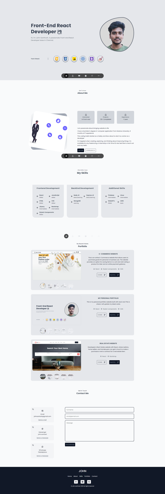

# React-portfolio-v1

<br>


## About The Project

#

This is my Personal Portfolio website built with `React`. This website is to showcase my recent works and project which I am currently working with.

👉 [Live Demo](https://john-react-portfolio.netlify.app/)

## Build with:

» React  
 » CMS  
 » Styled Components

<br/>

# Screenshot of the project 📸

<br/>
 <h2 align=center>Main Page 🏡</h2>



## Installation

```bash
  git clone https://github.com/John-santhosh/React-portfolio-v1

  npm intall

  npm run dev
```

## contribution

Pull requests are welcome, For Major changes, please open an issue first to discuss what you want to like to change
